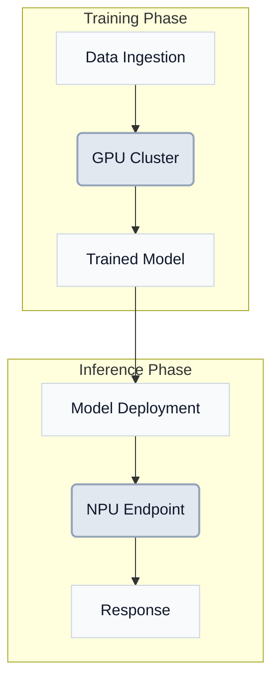
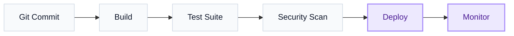
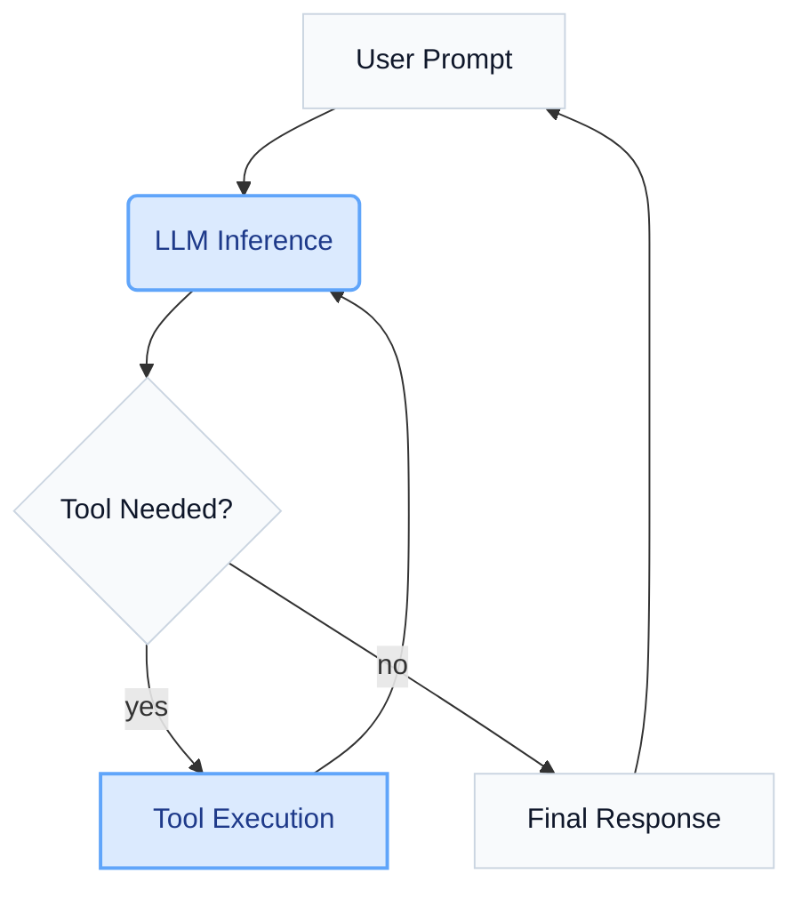

# Mermaid Infographic Skill

Create publication-ready Mermaid diagrams for thecloudarchitect.io and markets.thecloudarchitect.io articles. All diagrams must pass Mermaid v11 parsing and render in the CMS publishing pipeline.

## Slash Command

`/create-infographic` — Generate a mermaid diagram for the current article topic.

## Quick Start

1. Determine the diagram type from the article context (flowchart, sequence, architecture, data flow).
2. Write the mermaid source following **v11 Syntax Rules** below.
3. Append the **Brand Palette classDefs** block.
4. Wrap in a fenced code block: ` ```mermaid ... ``` `.
5. Validate against the **Pitfall Checklist** before inserting.

---

## Mermaid v11 Syntax Rules

### Subgraphs

Subgraph IDs must be a **single word** (no spaces). Use the bracket label for display text.

```
subgraph TrainingPhase ["Training Phase (GPU-centric)"]
    A --> B
end
```

**Never:**
```
subgraph Training Phase [GPU-centric]
```

### Node IDs

- Single word, alphanumeric + underscore: `nodeA`, `data_store`, `apiGateway`.
- **Never** use `end`, `subgraph`, `graph`, `flowchart`, `default` as node IDs.
- Use camelCase or snake_case consistently within a diagram.

### Labels

- Quote labels that contain special characters: `A["Process (main)"]`, `B["Step 1: Init"]`.
- **`&` is a breaking character in Mermaid v11** — always quote labels that contain `&`:
  - Rhombus: `H{"LLM Inference & Tool Calling"}` (not `H{LLM Inference & Tool Calling}`).
  - Round: `G("Read & Write")` (not `G(Read & Write)`).
  - Bracket: `A["Reads & Writes"]`.
- Avoid `://` in labels. Use `: ` instead (e.g., `gs: my-bucket` not `gs://my-bucket`).
- For parentheses inside bracket labels: `D["Weights (100T+ params)"]`.
- Keep labels under 40 characters for readability.

> **Important — do not use trailing semicolons on node/edge lines.**
> The CMS sanitizer strips trailing semicolons and re-applies quoting fixes in the correct order, but writing clean source (no semicolons) avoids any risk of interaction. Always write:
> ```
> G --> H{"LLM Inference & Tool Calling"}
> ```
> not:
> ```
> G --> H{LLM Inference & Tool Calling};
> ```

### Edge Labels

- Quote edge labels with special characters: `A -->|"O(1) lookup"| B`.
- Plain labels are fine for simple text: `A -->|sends| B`.

### Shapes

| Shape       | Syntax              | Use for                     |
|-------------|---------------------|-----------------------------|
| Rectangle   | `A[Label]`          | Process, service, component |
| Round        | `A(Label)`          | Input, request, trigger     |
| Rhombus     | `A{Label}`          | Decision, condition         |
| Stadium     | `A([Label])`        | Start / end                 |
| Cylinder    | `A[(Label)]`        | Database, storage           |
| Hexagon     | `A{{Label}}`        | Event, message              |

### Diagram Direction

- `TD` (top-down) for hierarchical architectures and pipelines.
- `LR` (left-right) for sequential flows, timelines, CI/CD.

---

## Brand Palette classDefs

Append this block to every diagram for thecloudarchitect.io articles:

```
classDef default fill:#f8fafc,stroke:#cbd5e1,stroke-width:1px,color:#0f172a
classDef physical fill:#e2e8f0,stroke:#94a3b8,stroke-width:2px,color:#0f172a
classDef network fill:#dbeafe,stroke:#60a5fa,stroke-width:2px,color:#1e3a8a
classDef cloud fill:#ede9fe,stroke:#a78bfa,stroke-width:2px,color:#4c1d95
classDef data fill:#dcfce7,stroke:#4ade80,stroke-width:2px,color:#14532d
classDef alert fill:#fef2f2,stroke:#f87171,stroke-width:2px,color:#7f1d1d
```

### Class assignments

| Class      | Apply to                                     |
|------------|----------------------------------------------|
| `physical` | Hardware, GPUs, NPUs, servers, bare metal    |
| `network`  | APIs, requests, endpoints, load balancers    |
| `cloud`    | Cloud services, managed platforms, SaaS      |
| `data`     | Databases, storage, data lakes, caches       |
| `alert`    | Errors, warnings, security, failures         |
| `default`  | Everything else                              |

Example:
```
class gpuCluster,npuEndpoint physical
class apiGateway,loadBalancer network
class vertexAI,sagemaker cloud
class postgres,redisCache data
```

---

## Diagram Patterns

### Architecture Split (Training vs Inference)



### CI/CD Pipeline



### Agentic Workflow Loop



---

## Visual Guidelines

- **Max nodes**: 15-20 per diagram. Split larger systems into multiple diagrams.
- **Subgraphs**: Use when grouping 3+ related nodes. Max 3 subgraphs per diagram.
- **Labels**: Short and scannable. Use the node shape to convey type; use the label for identity.
- **Theme**: `neutral` (configured in `tech_article.html`). Do not add theme directives in the source.
- **Accessibility**: Mermaid divs get `role="img" aria-label="Architecture diagram"` via the publishing pipeline.

---

## Integration with CMS Pipeline

1. **Author prompt** (`tech_article.j2`): Drafter writes fenced ` ```mermaid ``` ` blocks.
2. **Editor prompt** (`tech_editor.j2`): Editor preserves mermaid blocks and adds classDef lines.
3. **Publishing** (`article_publishing_service.py`): `_sanitize_mermaid()` auto-fixes common issues:
   - Subgraph IDs with spaces are collapsed to camelCase.
   - Bracket labels get quoted (parentheses preserved inside quotes).
   - Round `()` and rhombus `{}` labels containing `&`, `://`, or nested `(` are quoted in-place (shape preserved).
   - `://` in labels replaced with `: `.
   - Trailing semicolons on node/edge lines are stripped **after** all label fixes are applied — the order is guaranteed.
     > **Known past bug (fixed):** If lines had trailing `;`, the semicolon handler previously ran on the original line, discarding `&`-quoting and parenthesis fixes. This is resolved — but writing source without trailing semicolons keeps the diagram portable outside the CMS pipeline too.
4. **Client render** (`tech_article.html`): Mermaid v11 loaded from jsDelivr. `mermaid.initialize({ startOnLoad: false, theme: 'neutral', securityLevel: 'loose' })`.

---

## Pitfall Checklist

Before inserting a diagram, verify:

- [ ] Subgraph IDs are single words (no spaces).
- [ ] No node ID is a reserved word (`end`, `subgraph`, `graph`, `default`).
- [ ] Labels with `(`, `)`, `:`, `://`, or **`&`** are double-quoted inside their shape delimiters: `["label"]`, `("label")`, `{"label"}`.
- [ ] **`&` never appears in an unquoted label** (causes Mermaid v11 syntax error).
- [ ] **No trailing semicolons on node/edge lines** — write `A --> B` not `A --> B;`.
- [ ] Edge labels with special chars are quoted: `|"label"|`.
- [ ] `classDef default` overrides the built-in default (intentional).
- [ ] Max 20 nodes, max 3 subgraphs.
- [ ] Direction (`TD`/`LR`) matches the content flow.
- [ ] Brand palette classDefs appended.
- [ ] No `style`, `click`, or `linkStyle` directives (theme handles styling).
- [ ] Tested by pasting into https://mermaid.live before committing.

---

## Decision Tree: Which Diagram Type?

```
Is it a process with sequential steps?
  YES -> Is it time-based?
    YES -> Use `graph LR` (timeline / pipeline)
    NO  -> Use `graph TD` (flowchart)
  NO  -> Does it involve request/response pairs?
    YES -> Use `sequenceDiagram`
    NO  -> Does it show system components and their connections?
      YES -> Use `graph TD` with subgraphs (architecture)
      NO  -> Use `graph TD` (general flowchart)
```
