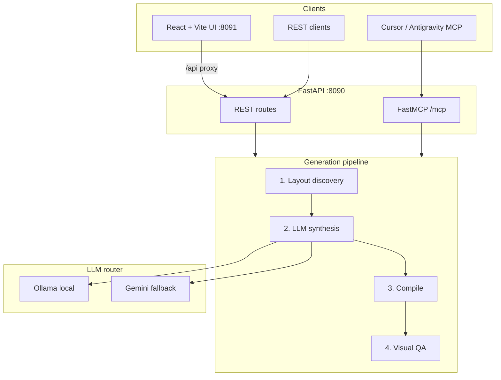

# PPTX Engine — System Architecture

This document describes the **implemented** system. The original product specification is in [briefs/architecture.md](briefs/architecture.md).

## Overview

Presentations@Carmélites is a local-first service that turns a content brief (and optional template) into a PowerPoint deck with Material Design 3 styling and optional visual QA.



## Components

| Layer | Path | Role |
|-------|------|------|
| Config | `src/presentations/config/` | Settings, logging |
| Core | `src/presentations/core/` | Schemas, hardware profiles, template models |
| Ingest | `src/presentations/ingest/` | `.pptx` / `.md` layout discovery, MD3 tokens |
| LLM | `src/presentations/llm/` | Ollama + Gemini providers, synthesis |
| Compile | `src/presentations/compile/` | `python-pptx` template fill; `pptxgenjs` scratch builder |
| QA | `src/presentations/qa/` | LibreOffice → PDF → JPEG; geometric + VLM audit |
| Services | `src/presentations/services/` | Pipeline orchestration, template registry |
| API | `src/presentations/api/` | FastAPI app, CORS, static QA image serving |
| MCP | `src/presentations/mcp/` | FastMCP tools (stdio or HTTP) |
| UI | `frontend/` | React + Vite MD3 web app |
| Scripts | `scripts/office/` | PPTX unpack/pack helpers (Anthropic skill tooling) |

Python package name: **`presentations`** (avoids conflict with `python-pptx` import `pptx`).

## Generation modes

| Mode | Compile path | Template source |
|------|--------------|-----------------|
| `template` | `python-pptx` placeholder fill | Corporate `.pptx` from library or path |
| `scratch` | Node `pptxgenjs` subprocess | MD3 tokens from `md3-tokens-tech.css` |

The LLM always produces a strict **`DeckSpec`** JSON (`layout_index`, `ph_idx`, `content` mappings) regardless of mode.

## Template library

Templates persist under `DATA_DIR/templates/`:

```
data/templates/
  registry.json
  {template_id}/
    template.pptx   # or template.md
```

Layout profiles are **cached at registration** so generation does not re-parse templates on every run. See [TEMPLATE_LIBRARY_GUIDE.md](TEMPLATE_LIBRARY_GUIDE.md).

## Data directories

All runtime data lives under `DATA_DIR` (default `./data`):

| Subdirectory | Purpose |
|--------------|---------|
| `templates/` | Template library + registry |
| `output/` | Generated `.pptx` files |
| `qa/` | Rendered slide JPEGs for QA |
| `staging/` | Intermediate PDFs during QA |
| `uploads/` | Temporary upload staging |
| `logs/` | Application log file |

## Hardware profiles

Detected automatically (or overridden via `HARDWARE_PROFILE`):

| Profile | Synthesis model | VLM |
|---------|-----------------|-----|
| Integrated (Radeon 780M) | `qwen2.5:7b` | `qwen2.5vl:7b` (optional) |
| Discrete (RTX 5070 Ti) | `qwen2.5:7b` | `qwen2.5vl:7b` |

Supported local synthesis models (UI catalog): `qwen2.5:7b`, `qwen2.5:3b`, `llama3.2:3b`. VLM audit uses `qwen2.5vl:7b`.

## Docker topology

| Service | Image | Port | Notes |
|---------|-------|------|-------|
| `pptx-api` | `presentations/Dockerfile` | 8090 | Python API + MCP at `/mcp` |
| `pptx-ui` | `presentations/Dockerfile.ui` | 8091 | nginx serves React build; proxies `/api/` → `pptx-api:8090` |

Shared volume: `pptx-data` mounted at `/data`.

## Related files

- Entry points: `pptx-api`, `pptx-mcp` in `pyproject.toml`
- Pipeline: [`src/presentations/services/pipeline.py`](../src/presentations/services/pipeline.py)
- Template registry: [`src/presentations/services/template_registry.py`](../src/presentations/services/template_registry.py)
