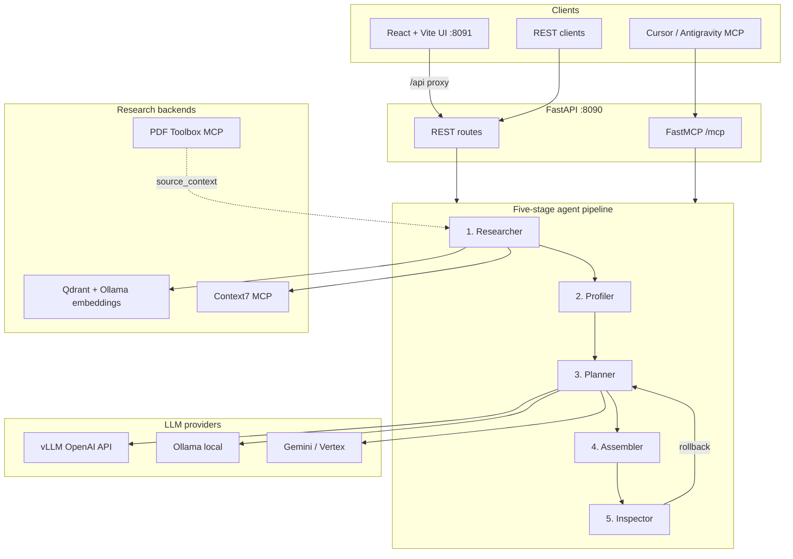

# PPTX Engine — System Architecture

This document describes the **implemented** system. The original product specification is in [briefs/architecture.md](briefs/architecture.md).

## Overview

Presentations@Carmélites is a local-first service that turns a content brief (and optional source documents) into a PowerPoint deck with Material Design 3 styling, optional RAG grounding, and a validation loop with planner rollback.



## Agent pipeline

Generation is orchestrated in [`backend/presentations/agents/orchestrator.py`](../backend/presentations/agents/orchestrator.py). Each stage updates a shared [`PipelineState`](../backend/presentations/core/state.py).

| Stage | Agent | Responsibility |
|-------|-------|----------------|
| 1 | **Researcher** | Index `source_context` into Qdrant (when `RAG_ENABLED`), retrieve top snippets for the brief, append Context7 docs for IT-topic briefs |
| 2 | **Profiler** | Resolve `template_id` / path; load cached or discovered `LayoutProfile` |
| 3 | **Planner** | Synthesize strict `DeckSpec` JSON via vLLM, Ollama, or Gemini; applies digest phase and rollback feedback on retries |
| 4 | **Assembler** | Compile native `.pptx` (`python-pptx` template fill or pptxgenjs scratch); layout sanitization and Anthropic skill formatting rules |
| 5 | **Inspector** | Content QA (markitdown), overflow checks, geometric slide audit, optional VLM; on failure rolls back to Planner |

### Revision loop

When `run_qa=true`, the Inspector runs after each assemble. If validation fails and `revision < MAX_REVISIONS`, rollback reasons are injected into the Planner prompt and stages 3–5 repeat. The last output is returned even if QA never passes.

Inspector checks (see [`inspector.py`](../backend/presentations/agents/inspector.py)):

- Leftover placeholder text in exported content
- Estimated text overflow per placeholder
- Unicode bullet formatting
- Geometric overlap on rendered slide JPEGs
- Optional VLM audit when `QA_VLM_ENABLED=true` or `allow_cloud=true`

## Components

| Layer | Path | Role |
|-------|------|------|
| Config | `backend/presentations/config/` | Settings, logging |
| Core | `backend/presentations/core/` | Schemas, hardware profiles, pipeline state, template models |
| Agents | `backend/presentations/agents/` | Five-stage orchestrator and stage implementations |
| Ingest | `backend/presentations/ingest/` | Layout discovery, MD3 tokens, PDF extraction, optional Docling |
| LLM | `backend/presentations/llm/` | Ollama, vLLM, Gemini providers, synthesis, layout validation, model catalog |
| RAG | `backend/presentations/rag/` | Qdrant store, embeddings, indexer, retriever |
| Compile | `backend/presentations/compile/` | `python-pptx` template fill; `pptxgenjs` scratch builder |
| QA | `backend/presentations/qa/` | LibreOffice → PDF → JPEG render helpers; geometric checks |
| Services | `backend/presentations/services/` | Template registry, PDF MCP client, Context7 client, topic classifier |
| API | `backend/presentations/api/` | FastAPI app, CORS, path-safe downloads |
| MCP | `backend/presentations/mcp/` | FastMCP tools (stdio or HTTP) |
| UI | `frontend/` | React + Vite MD3 web app (tabbed generate / library / diagnostics) |
| Scripts | `scripts/office/` | PPTX unpack/pack helpers (Anthropic skill tooling) |

Python package name: **`presentations`** (avoids conflict with `python-pptx` import `pptx`).

## Generation modes

| Mode | Compile path | Template source |
|------|--------------|-----------------|
| `template` | `python-pptx` placeholder fill | Corporate `.pptx` from library or path |
| `scratch` | Node `pptxgenjs` subprocess | MD3 tokens from `md3-tokens-tech.css` |

The Planner always produces a strict **`DeckSpec`** JSON (`layout_index`, `ph_idx`, `content` mappings) regardless of mode.

## Source grounding

| Input | How it is used |
|-------|----------------|
| `brief` | Presentation intent (audience, tone, slide count) — required |
| `source_context` | PDF-derived or pasted reference text for factual grounding |
| RAG | Chunks `source_context` into Qdrant; retrieves snippets aligned to the brief |
| Digest phase | When `ENABLE_DIGEST_PHASE=true`, long `source_context` is summarised into structured facts before synthesis |
| Context7 | For IT-topic briefs, fetches library documentation when `CONTEXT7_API_KEY` is set |
| PDF upload | `POST /ingest/pdf` or PDF Toolbox MCP stages files into shared workspace |

## LLM routing

| Provider | Typical use | Config |
|----------|-------------|--------|
| **vLLM** | Planner / structured JSON (`qwen2.5-coder:14b-awq` catalog id) | `VLLM_BASE_URL`, `VLLM_ENABLED` |
| **Ollama** | Default local synthesis and embeddings (`bge-m3`) | `OLLAMA_HOST`, model tags |
| **Gemini** | Cloud fallback and vision QA when `allow_cloud=true` | `GOOGLE_CLOUD_PROJECT`, ADC |

Model catalog for the UI: `GET /models` — see [`llm/catalog.py`](../backend/presentations/llm/catalog.py).

Cloud LLM is **opt-in per request** only (`allow_cloud=true` in the API or Cloud AI toggle in the UI).

## Template library

Templates persist under `DATA_DIR/templates/`:

```
data/templates/
  registry.json
  {template_id}/
    template.pptx   # or template.md
```

Layout profiles are **cached at registration** so generation does not re-parse templates on every run. See [TEMPLATE_LIBRARY_GUIDE.md](TEMPLATE_LIBRARY_GUIDE.md).

## Data directories

All runtime data lives under `DATA_DIR` (default `./data`):

| Subdirectory | Purpose |
|--------------|---------|
| `templates/` | Template library + registry |
| `output/` | Generated `.pptx` files |
| `qa/` | Rendered slide JPEGs for QA |
| `staging/` | Intermediate PDFs during QA |
| `uploads/` | Temporary upload staging |
| `logs/` | Application log file |

## Hardware profiles

Detected automatically (or overridden via `HARDWARE_PROFILE`):

| Profile | Synthesis model | VLM |
|---------|-----------------|-----|
| Integrated (Radeon 780M) | `qwen2.5:7b` | `qwen2.5vl:7b` (optional) |
| Discrete (RTX 5070 Ti) | `qwen2.5:7b` | `qwen2.5vl:7b` |

Supported local synthesis models (UI catalog): `qwen2.5-coder:14b-awq` (vLLM), `qwen2.5:7b`, `qwen2.5:3b`, `llama3.2:3b`, `gemini-2.0-flash` (cloud). VLM audit uses `qwen2.5vl:7b` or Gemini vision when enabled.

## Docker topology

| Service | Image | Port | Notes |
|---------|-------|------|-------|
| `pptx-api` | `docker/Dockerfile` | 8090 | Python API + MCP at `/mcp` |
| `pptx-ui` | `docker/Dockerfile.ui` | 8091 | nginx serves React build; proxies `/api/` → `pptx-api:8090` |
| `qdrant` | `qdrant/qdrant` | 6333 | Vector store for RAG (always started) |
| `vllm` | `vllm/vllm-openai` | 8000 | Optional GPU profile (`docker compose --profile gpu`) |

Shared volumes: `pptx-data` at `/data`; `qdrant-data` for vectors; `vllm-cache` for model weights.

Host services expected via `host.docker.internal`: Ollama (`11434`), PDF Toolbox MCP (`3005`).

Optional Python extra for Docling parsing: `pip install -e ".[rag]"`.

## Related files

- Entry points: `pptx-api`, `pptx-mcp` in `pyproject.toml`
- Orchestrator: [`backend/presentations/agents/orchestrator.py`](../backend/presentations/agents/orchestrator.py)
- Template registry: [`backend/presentations/services/template_registry.py`](../backend/presentations/services/template_registry.py)
- Synthesis: [`backend/presentations/llm/synthesis.py`](../backend/presentations/llm/synthesis.py)
